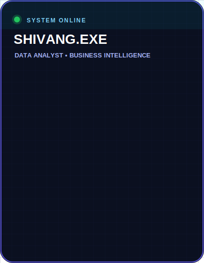

# Hi, I'm Shivang Chaubey 👋

### MBA Candidate | Data Analyst | Business Strategist

  

  
  
  
  

---

## 👨‍💻 About Me

<table>
<tr>

<td valign="top" width="70%">

### 🚀 Who Am I?

- 🔍 Aspiring **Data Analyst** passionate about transforming raw data into actionable business insights.
- 📊 Building **interactive dashboards** with Power BI, Tableau, Excel & Google Sheets.
- 🐍 Automating **ETL pipelines, data cleaning and reporting** using Python & SQL.
- 🌐 Developing modern web applications using **React, Next.js & TypeScript**.
- 📈 Passionate about **Business Intelligence, KPI Tracking, Data Visualization & RFM Analysis**.
- 🎓 Currently pursuing an **MBA** while strengthening my skills in Analytics & Strategy.
- 🚀 Built multiple real-world projects focused on solving business problems with data.
- 💡 Always learning new technologies and exploring smarter ways to turn data into decisions.
- 🌍 Portfolio: **[shivangchaubey.vercel.app](https://shivangchaubey.vercel.app/)**
- 📬 Let's connect on **[LinkedIn](https://www.linkedin.com/in/ishivangchaubey/)**

</td>

<td valign="top" width="30%" align="center">

</td>

</tr>
</table>

---

## 🛠️ Tech Stack

### 📊 Data & Analytics

  
  
  
  
  
  

### 💡 Data Skills

  
  
  
  
  
  
  

### 🌐 Frontend Development

  
  
  
  
  
  

### 🔧 Tools & Platforms

  
  

---

## 📈 GitHub Analytics

---

## 🐍 My Contributions

<picture>
  <source media="(prefers-color-scheme: dark)" srcset="https://raw.githubusercontent.com/shivangislost/shivangislost/output/github-contribution-grid-snake-dark.svg"/>
  <source media="(prefers-color-scheme: light)" srcset="https://raw.githubusercontent.com/shivangislost/shivangislost/output/github-contribution-grid-snake.svg"/>
  
</picture>

---
## 🤝 Let's Connect

  

